#  Cloud-Native Monitoring and Observability Platform on AWS


---

##  Project Overview

This project demonstrates the setup of a centralized **Cloud-Native Monitoring and Observability Platform on AWS** for two EC2-based NGINX web servers.

The project uses one dedicated **Monitoring Server** and two **Web Servers**. The Monitoring Server runs Prometheus, Grafana, Loki, and Node Exporter. The Web Servers run NGINX, Node Exporter, Promtail, CloudWatch Agent, and SSM Agent.

The monitoring setup collects:

    EC2 infrastructure metrics
    CPU, memory, disk, filesystem, and network metrics
    NGINX access and error logs
    Linux system logs
    Authentication logs
    CloudWatch custom metrics and log groups
    NGINX website heartbeat status

The project also implements an automated recovery workflow. A **CloudWatch Synthetics Canary** continuously monitors the NGINX website endpoint. When NGINX is stopped or the website becomes unavailable, the Canary fails, a CloudWatch Alarm enters the `ALARM` state, SNS sends an email notification, EventBridge triggers a Lambda function, and Lambda uses AWS Systems Manager Run Command to restart NGINX automatically.

This practical project focuses only on EC2-based web server monitoring and auto-remediation.
---

##  Architectural Flow
```Metrics:```
```
    User / Admin
         |
         v
                          Grafana Dashboard
                                 |
         |---------------- Metrics Flow ----------------|
     
    Prometheus <--------- Node Exporter <--------- WebServer-01
         |                                          WebServer-02
         |                                               |          
         v                                               v
    Grafana Visualizes Metrics <----------------- CloudWatch Agent              
       in Dashboards 
```
```Logs:```
```
    NGINX Logs / System Logs / Secure Logs
             |
             v
    Promtail on Web Servers
             |
             v
    Loki on Monitoring Server
             |
             v
    Grafana Explore -------> Logs Dashboard
```
```Auto-Remediation:```
```

    NGINX Website URL Endpoint
           |
           v
    CloudWatch Synthetics Canary
           |
           v
    CloudWatch Alarm
           |
           v
    SNS Email Notification
           |
           v
    EventBridge Rule
           |
           v
    Lambda Function
           |
           v
    AWS Systems Manager Run Command
           |
           v
    Restart NGINX on Web Servers
```
---

##  Architecture Diagram using Mermaid -Part 1:

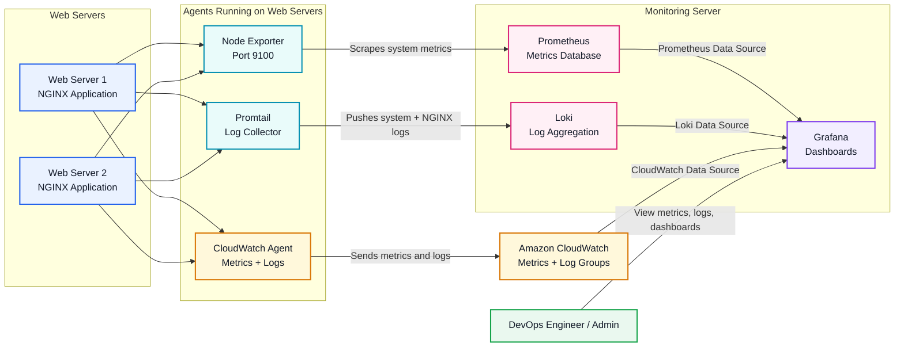

## Architecture Diagram using Mermaid -Part 2:

```mermaid
flowchart LR

    %% =========================
    %% APPLICATION ENDPOINTS
    %% =========================
    subgraph AppTier["Application Tier"]
        direction TB
         WebServer-1["Web Server 1<br/>NGINX Application<br/>Health Endpoint"]
         WebServer-2["Web Server 2<br/>NGINX Application<br/>Health Endpoint"]
    end

    %% =========================
    %% SYNTHETIC MONITORING
    %% =========================
    subgraph MonitorTier["Synthetic Monitoring"]
        direction TB
        Canary["CloudWatch Synthetics Canary<br/>Heartbeat Monitoring<br/>Checks both application URLs"]
    end

    %% =========================
    %% DETECTION AND ALERTING
    %% =========================
    subgraph AlertTier["Detection and Alerting"]
        direction TB
        Alarm["CloudWatch Alarm<br/>Metric: SuccessPercent<br/>Condition: less than 100"]
        SNS["Amazon SNS<br/>Email Alert Notification"]
    end

    %% =========================
    %% EVENT-DRIVEN AUTOMATION
    %% =========================
    subgraph AutomationTier["Event-Driven Automation"]
        direction TB
        EventBridge["Amazon EventBridge<br/>CloudWatch Alarm State Change Rule"]
        Lambda["AWS Lambda<br/>restart-unhealthy-service"]
        SSM["AWS Systems Manager<br/>Run Command"]
    end

    %% =========================
    %% RECOVERY
    %% =========================
    subgraph RecoveryTier["Service Recovery"]
        direction TB
        Restart["Restart NGINX Service<br/>on both App Servers"]
        Healthy["Website Reachable Again<br/>Service Healthy"]
    end

    %% =========================
    %% HEARTBEAT MONITORING FLOW
    %% =========================
     WebServer-1 -->|"Heartbeat URL check"| Canary
     WebServer-2 -->|"Heartbeat URL check"| Canary

    %% =========================
    %% FAILURE DETECTION FLOW
    %% =========================
    Canary -->|"Failed canary run<br/>endpoint unavailable"| Alarm
    Alarm -->|"Send notification"| SNS

    %% =========================
    %% AUTO-REMEDIATION FLOW
    %% =========================
    Alarm -->|"ALARM state change"| EventBridge
    EventBridge -->|"Invoke function"| Lambda
    Lambda -->|"Send SSM command"| SSM
    SSM -->|"sudo systemctl restart nginx"| Restart
    Restart -->|"Health check passes"| Healthy

    %% =========================
    %% RECOVERY VALIDATION LOOP
    %% =========================
    Healthy -.->|"Canary succeeds again"| Canary

    %% =========================
    %% STYLING
    %% =========================
    classDef web fill:#EAF2FF,stroke:#2563EB,stroke-width:2px,color:#111827;
    classDef canary fill:#E9FBFA,stroke:#0891B2,stroke-width:2px,color:#111827;
    classDef alarm fill:#FFF8DB,stroke:#D97706,stroke-width:2px,color:#111827;
    classDef sns fill:#FFF0F6,stroke:#DB2777,stroke-width:2px,color:#111827;
    classDef event fill:#F2EEFF,stroke:#7C3AED,stroke-width:2px,color:#111827;
    classDef lambda fill:#FFF4E2,stroke:#EA580C,stroke-width:2px,color:#111827;
    classDef ssm fill:#EAF8EF,stroke:#16A34A,stroke-width:2px,color:#111827;
    classDef recovery fill:#ECFDF5,stroke:#15803D,stroke-width:2px,color:#111827;

    class WebServer-1,WebServer-2 web;
    class Canary canary;
    class Alarm alarm;
    class SNS sns;
    class EventBridge event;
    class Lambda lambda;
    class SSM ssm;
    class Restart,Healthy recovery;
```

---

##  Architecture Diagram
```Monitoring & Obesrvability Architecture:```
<p align="center">
  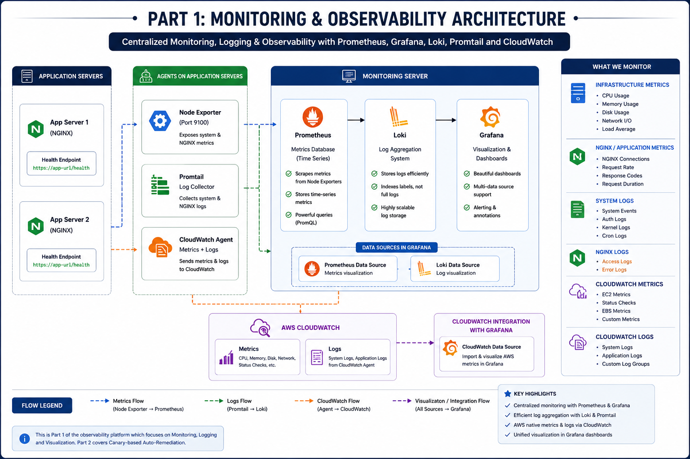
</p>

```Remediation Architecture:```
<p align="center">
  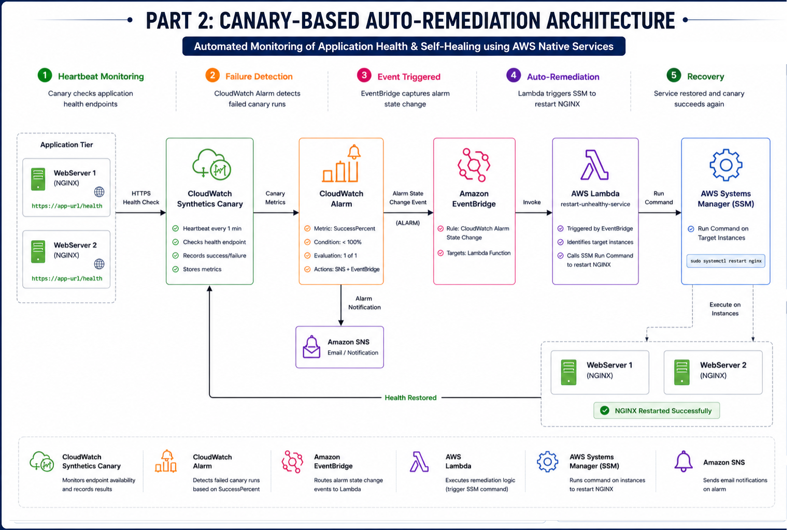
</p>

    Screenshots/Architecture-Diagram.png

---

##  Tools and Technologies Used

| Category | Tools / Services |
|---|---|
| Cloud Platform | AWS |
| Compute | Amazon EC2 |
| Web Server | NGINX |
| Metrics Collection | Prometheus, Node Exporter |
| Visualization | Grafana |
| Log Aggregation | Loki |
| Log Collection | Promtail |
| AWS Native Monitoring | Amazon CloudWatch |
| Custom Metrics and Logs | CloudWatch Agent |
| Synthetic Monitoring | CloudWatch Synthetics Canary |
| Alerting | CloudWatch Alarms, Amazon SNS |
| Event Automation | Amazon EventBridge |
| Auto-Remediation | AWS Lambda, AWS Systems Manager Run Command |
| Installation Automation | Shell Scripts |
| Operating System | Amazon Linux 2023 |
| Security | IAM Roles, Security Groups |
| Version Control | Git and GitHub |

---

##  Server Overview

| Server | Purpose | Components Installed |
|---|---|---|
| Monitoring Server | Central observability server | Prometheus, Grafana, Loki, Node Exporter |
| WebServer-01 | NGINX website and monitored server | NGINX, Node Exporter, Promtail, CloudWatch Agent, SSM Agent |
| WebServer-02 | NGINX website and monitored server | NGINX, Node Exporter, Promtail, CloudWatch Agent, SSM Agent |

---

##  Project Structure

    cloud-native-observability-platform/
    │
    ├── README.md
    ├── LICENSE
    │
    ├── Screenshots/
    │   ├── 1.Architecture-Diagram.png
    │   ├── 2.EC2-Instances.png
    │   ├── 3.Prometheus-Targets.png
    │   ├── 4.Grafana-Node-Exporter-Dashboard.png
    │   ├── 5.Loki-Logs-Grafana.png
    │   ├── 6.CloudWatch-Agent-Metrics.png
    │   ├── 7.CloudWatch-Log-Groups.png
    │   ├── 8.SNS-Email-Alert.png
    │   ├── 9.Synthetics-Canary-Failed.png
    │   ├── 10.CloudWatch-Alarm-In-Alarm.png
    │   ├── 11.EventBridge-Rule.png
    │   ├── 12.Lambda-Execution-Logs.png
    │   ├── 13.SSM-Run-Command-History.png
    │   └── 14.NGINX-Auto-Restarted.png
    │
    ├── scripts/
    │   ├── install-monitoring-stack.sh
    │   ├── install-node-exporter-web.sh
    │   ├── install-loki.sh
    │   ├── install-promtail.sh
    │   └── install-cloudwatch-agent.sh
    │
    ├── prometheus/
    │   ├── prometheus.yml
    │   └── rules/
    │       └── node-alerts.yml
    │
    ├── grafana/
    │   └── dashboards/
    │       ├── node-exporter-dashboard.json
    │       ├── loki-logs-dashboard.json
    │       └── cloudwatch-dashboard.json
    │
    ├── loki/
    │   └── loki-config.yml
    │
    ├── promtail/
    │   ├── WebServer-01-promtail-config.yml
    │   └── WebServer-02-promtail-config.yml
    │
    ├── cloudwatch-agent/
    │   └── cloudwatch-agent-config.json
    │
    ├── lambda-auto-remediation/
    │   └── lambda_function.py
    │
    ├── eventbridge/
    │   └── alarm-state-change-pattern.json
    │
    ├── iam-policies/
    │   ├── lambda-ssm-permissions.json
    │   └── ec2-ssm-cloudwatch-role.md
    │
    └── website/
        ├── index.html
        ├── health.html
        └── 404.html

---

#  Part 1: AWS EC2 Infrastructure Setup

##  EC2 Instance Setup

Three EC2 instances were created for this project:

    Monitoring Server
    WebServer-01
    WebServer-02

<p align="center">
  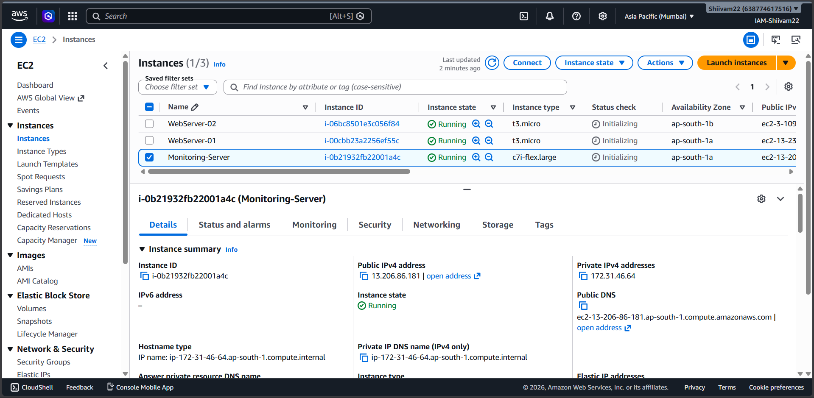
</p>

Recommended configuration:

| Configuration | Value |
|---|---|
| Region | `ap-south-1` |
| AMI | Amazon Linux 2023 |
| Monitoring Server | `c7i-flex.large` |
| Web Servers | `t3.micro` |
| Monitoring Server Storage | 15 GB |
| Web Server Storage | 8 GB |

---

##  Security Group Design

```Monitoring Server Security Group:```

<p align="center">
  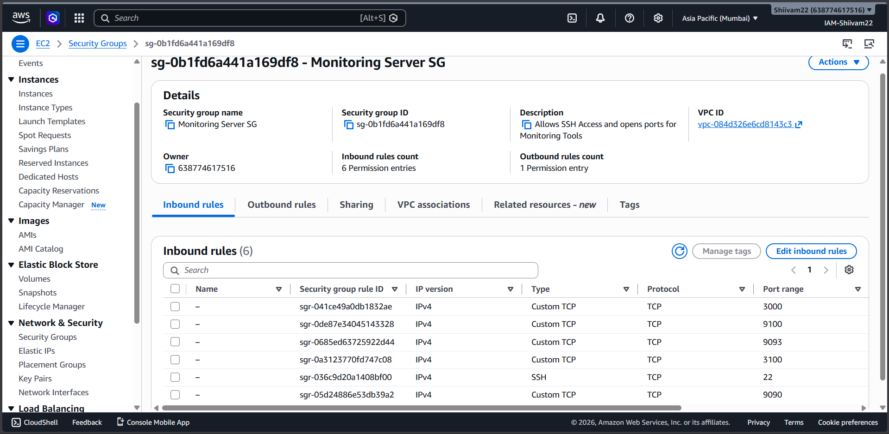
</p>

```Web Server Security Group:```

<p align="center">
  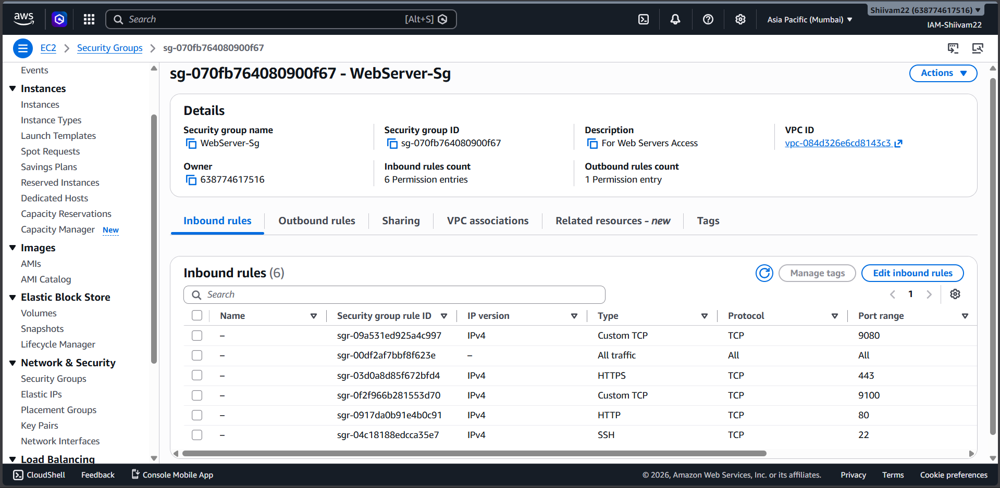
</p>

---

#  Part 2: NGINX Website Deployment

##  NGINX Overview

NGINX was installed on both WebServer-01 and WebServer-02 to serve a simple project website.

The website was used for:

    Generating NGINX access logs
    Generating NGINX error logs
    Testing Loki and CloudWatch log collection
    Providing a /health.html endpoint for CloudWatch Synthetics Canary
    Testing auto-remediation when NGINX is stopped

---

##  Install NGINX

Run on both Web Servers:

    sudo dnf update -y
    sudo dnf install nginx -y
    sudo systemctl enable nginx
    sudo systemctl start nginx
    sudo systemctl status nginx

<p align="center">
  
</p>

---

##  Deploy Website Files

Website files:
```index.html```
```health.html```
```404.html```

Copy files to the NGINX web root:

    cd /usr/share/nginx/html/index.html
    sudo vi index.html 
    sudo vi health.html 
    sudo vi 404.html 
    sudo systemctl restart nginx

<p align="center">
  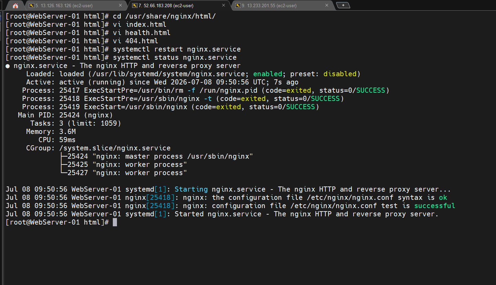
</p>

Health endpoint: ```http://WEB_SERVER_PUBLIC_IP/health.html```

---

#  Part 3: Monitoring Stack Installation Using Shell Script

##  Monitoring Stack Overview

A single shell script was used on the Monitoring Server to install:

    Prometheus
    Grafana
    Node Exporter

Script:

    vi install-Promograph.sh


<p align="center">
  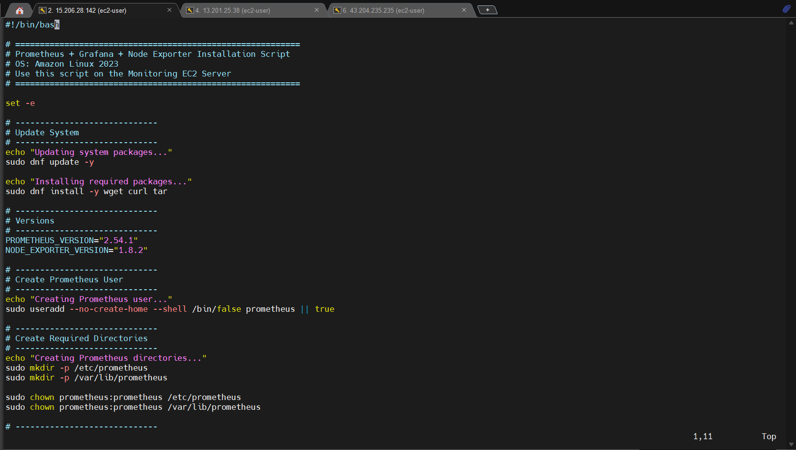
</p>

Run:

    chmod +x install-Promograph.sh
    ./install-Promograph.sh

<p align="center">
  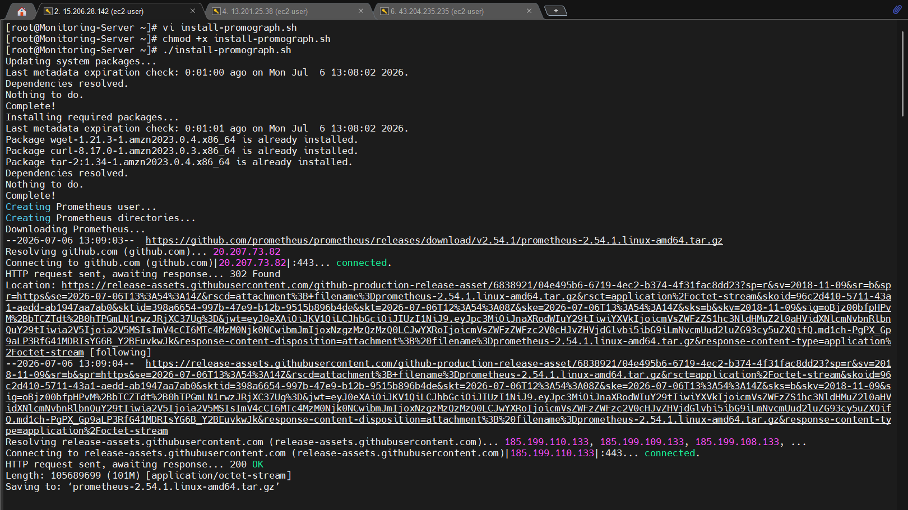
</p>

<p align="center">
  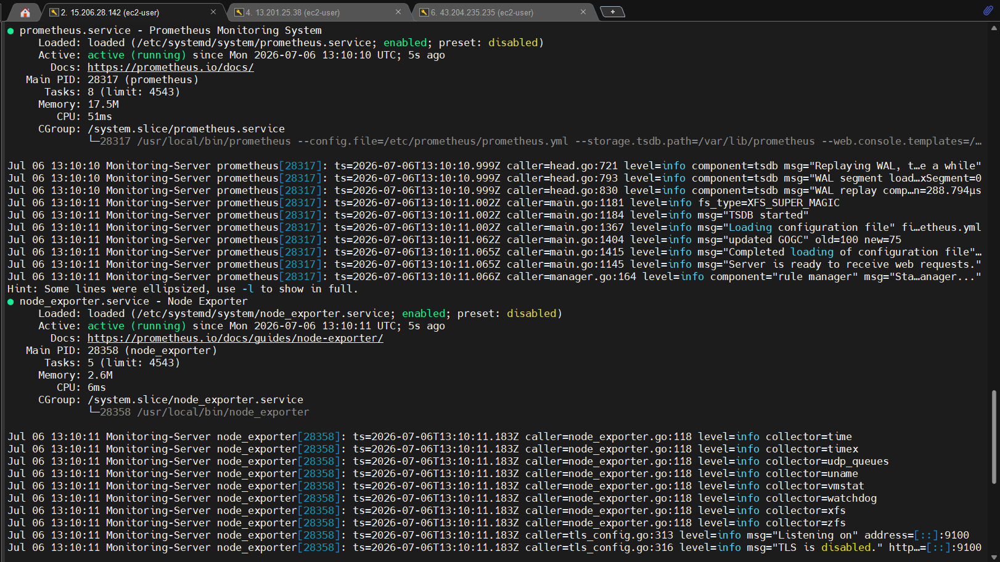
</p>

<p align="center">
  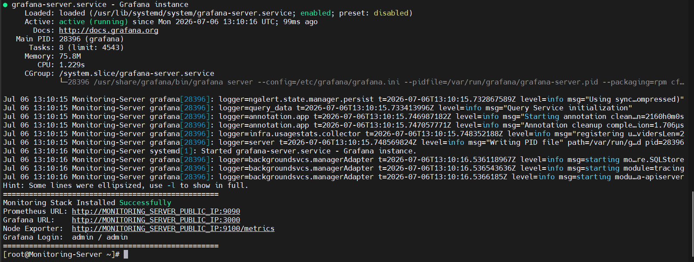
</p>

Prometheus URL: ```http://MONITORING_SERVER_PUBLIC_IP:9090``` <br>
Grafana URL: ```http://MONITORING_SERVER_PUBLIC_IP:3000```

---

#  Part 4: Node Exporter Installation on Web Servers

##  Node Exporter Overview

Node Exporter was installed on both Web Servers using a separate shell script.

Script:

    vi NodeExp.sh

<p align="center">
  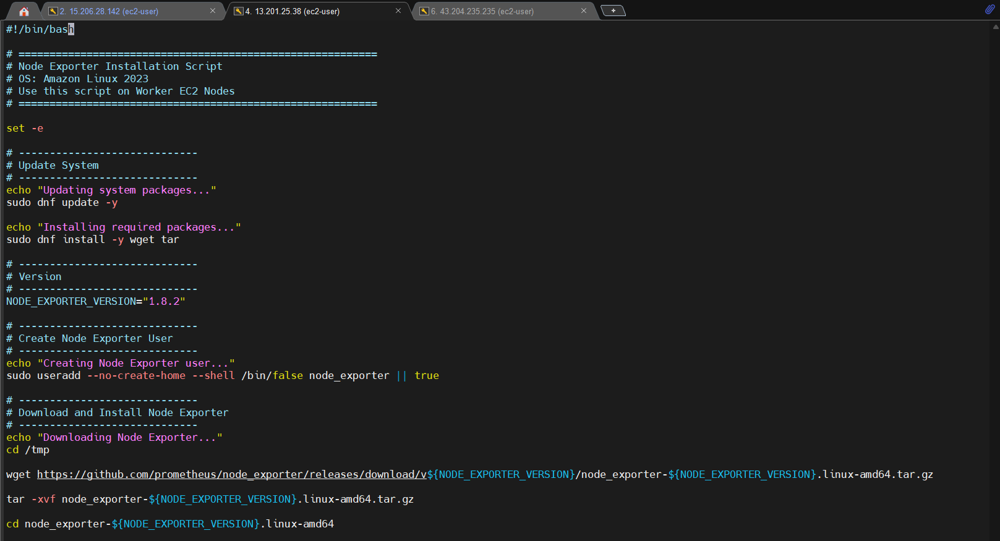
</p>


Run on WebServer-01 and WebServer-02:

    chmod +x scripts/install-node-exporter-web.sh
    ./scripts/install-node-exporter-web.sh

<p align="center">
  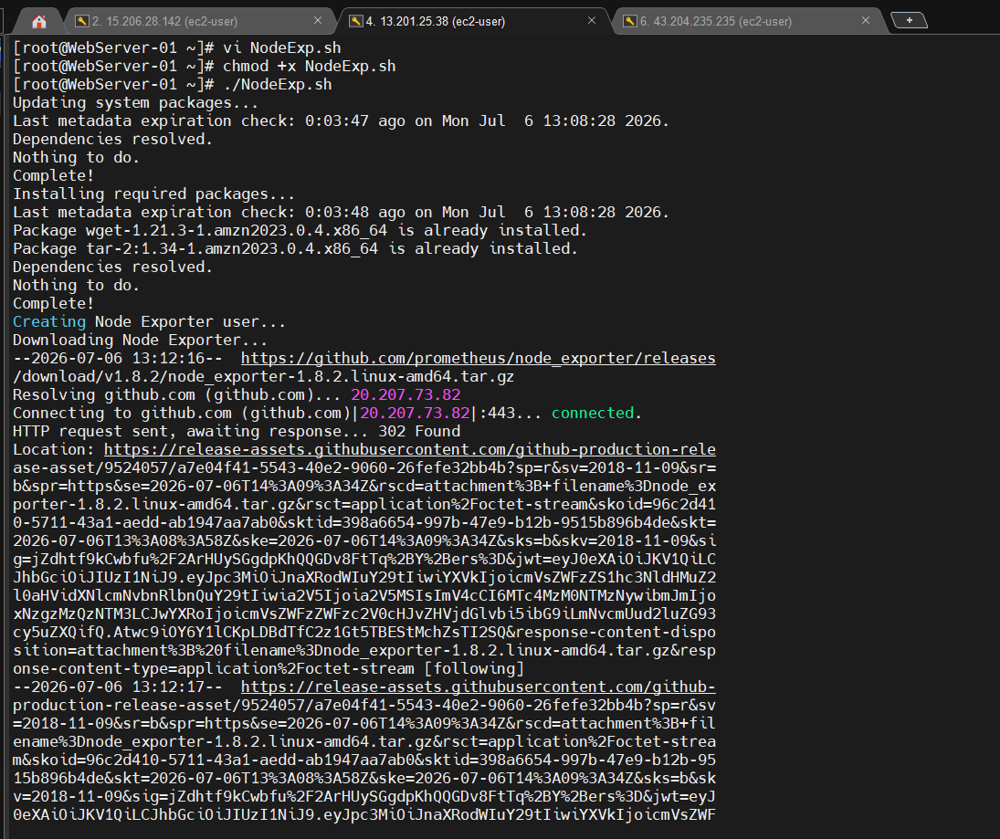
</p>


<p align="center">
  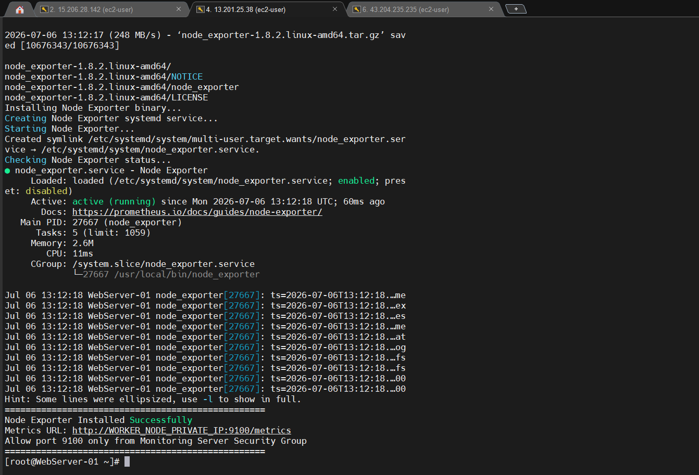
</p>

Node Exporter exposes metrics on:
  ```http://WEB_SERVER_PRIVATE_IP:9100/metrics```

Metrics collected:

    CPU usage
    Memory usage
    Disk usage
    Filesystem usage
    Network traffic
    System load
    Uptime

Verify locally: ```curl http://localhost:9100/metrics```

---

#  Part 5: Prometheus Configuration

##  Prometheus Overview

Prometheus was configured on the Monitoring Server to scrape Node Exporter metrics from both Web Servers.

Prometheus configuration file:

    /etc/prometheus/prometheus.yml

Example configuration:

```yaml
global:
  scrape_interval: 15s
  evaluation_interval: 15s

scrape_configs:
  - job_name: "prometheus"
    static_configs:
      - targets:
          - "localhost:9090"

  - job_name: "webservers-node-exporter"
    static_configs:
      - targets:
          - "WEBSERVER_01_PRIVATE_IP:9100"
          - "WEBSERVER_02_PRIVATE_IP:9100"
```

Restart Prometheus:

    sudo systemctl restart prometheus

Check targets:

    Prometheus → Status → Targets

Expected result:

    UP

---

#  Part 6: Grafana Dashboard Setup

##  Grafana Overview

Grafana was used to visualize Prometheus metrics, Loki logs, and CloudWatch metrics.

Default Grafana URL:

    http://MONITORING_SERVER_PUBLIC_IP:3000

Default credentials:

    Username: admin
    Password: admin

Prometheus data source:

    http://localhost:9090

Recommended dashboard:

    Node Exporter Full Dashboard
    Dashboard ID: 1860

Dashboard metrics:

    CPU utilization
    Memory usage
    Disk usage
    Network traffic
    Filesystem usage
    System uptime
    Load average

---

#  Part 7: Loki Installation on Monitoring Server

##  Loki Overview

Loki was installed on the Monitoring Server using a dedicated shell script.

Script:

    scripts/install-loki.sh

Run:

    chmod +x scripts/install-loki.sh
    ./scripts/install-loki.sh

Start and verify Loki:

    sudo systemctl enable loki
    sudo systemctl start loki
    sudo systemctl status loki

Readiness check:

    curl http://localhost:3100/ready

Expected output:

    ready

---

#  Part 8: Promtail Installation on Web Servers

##  Promtail Overview

Promtail was installed on both Web Servers using a separate shell script.

Script:

    scripts/install-promtail.sh

Run on WebServer-01 and WebServer-02:

    chmod +x scripts/install-promtail.sh
    ./scripts/install-promtail.sh

Promtail configuration path:

    /etc/promtail/promtail-config.yml

Example configuration for WebServer-01:

```yaml
server:
  http_listen_port: 9080
  grpc_listen_port: 0

positions:
  filename: /var/lib/promtail/positions.yaml

clients:
  - url: http://MONITORING_SERVER_PRIVATE_IP:3100/loki/api/v1/push

scrape_configs:
  - job_name: system
    static_configs:
      - targets:
          - localhost
        labels:
          job: system
          host: WebServer-01
          __path__: /var/log/messages

  - job_name: secure
    static_configs:
      - targets:
          - localhost
        labels:
          job: secure
          host: WebServer-01
          __path__: /var/log/secure

  - job_name: nginx
    static_configs:
      - targets:
          - localhost
        labels:
          job: nginx
          host: WebServer-01
          __path__: /var/log/nginx/*.log
```

For WebServer-02, the host label was changed to:

    host: WebServer-02

Restart Promtail:

    sudo systemctl restart promtail
    sudo systemctl status promtail

Check logs:

    sudo journalctl -u promtail -f

---

#  Part 9: Loki Data Source and Log Queries in Grafana

##  Add Loki Data Source

In Grafana:

    Connections → Data sources → Add data source → Loki

Loki URL:

    http://localhost:3100

Test LogQL queries:

```logql
{host="WebServer-01"}
```

```logql
{host="WebServer-02"}
```

```logql
{job="nginx"}
```

```logql
{job="system"}
```

Generate test logs:

    logger "Test log from WebServer-01"
    curl http://localhost
    curl http://localhost/not-found

---

#  Part 10: CloudWatch Agent Setup

##  CloudWatch Agent Overview

CloudWatch Agent was installed on both Web Servers to send custom metrics and logs to Amazon CloudWatch.

IAM policies attached to Web Server role:

    CloudWatchAgentServerPolicy
    AmazonSSMManagedInstanceCore

CloudWatch Agent config path:

    /opt/aws/amazon-cloudwatch-agent/bin/config.json

Example configuration:

```json
{
  "agent": {
    "metrics_collection_interval": 60,
    "run_as_user": "root"
  },
  "metrics": {
    "namespace": "ObservabilityProject/EC2",
    "metrics_collected": {
      "mem": {
        "measurement": [
          "mem_used_percent"
        ]
      },
      "disk": {
        "measurement": [
          "used_percent"
        ],
        "resources": [
          "/"
        ]
      }
    }
  },
  "logs": {
    "logs_collected": {
      "files": {
        "collect_list": [
          {
            "file_path": "/var/log/messages",
            "log_group_name": "/observability/ec2/messages",
            "log_stream_name": "{instance_id}"
          },
          {
            "file_path": "/var/log/secure",
            "log_group_name": "/observability/ec2/secure",
            "log_stream_name": "{instance_id}"
          },
          {
            "file_path": "/var/log/nginx/access.log",
            "log_group_name": "/observability/nginx/access",
            "log_stream_name": "{instance_id}"
          },
          {
            "file_path": "/var/log/nginx/error.log",
            "log_group_name": "/observability/nginx/error",
            "log_stream_name": "{instance_id}"
          }
        ]
      }
    }
  }
}
```

Start CloudWatch Agent:

    sudo /opt/aws/amazon-cloudwatch-agent/bin/amazon-cloudwatch-agent-ctl \
    -a fetch-config \
    -m ec2 \
    -s \
    -c file:/opt/aws/amazon-cloudwatch-agent/bin/config.json

Check status:

    sudo /opt/aws/amazon-cloudwatch-agent/bin/amazon-cloudwatch-agent-ctl -a status

Verify:

    CloudWatch → Metrics → ObservabilityProject/EC2
    CloudWatch → Logs → Log groups

---

#  Part 11: SNS Alert Notification

##  SNS Overview

Amazon SNS was configured to send email notifications when a CloudWatch Alarm enters the `ALARM` state.

SNS topic:

    observability-alerts

Alert flow:

    CloudWatch Alarm
          |
          v
    SNS Topic
          |
          v
    Email Notification
          |
          v
    DevOps Engineer / Admin

SNS was used for:

    NGINX health check failure alert
    Canary failure alert
    Infrastructure alarm notifications

---

#  Part 12: CloudWatch Synthetics Canary

##  Canary Overview

CloudWatch Synthetics Canary was configured as a heartbeat monitor for the NGINX website endpoint.

Canary type:

    Heartbeat monitoring

Canary endpoint:

    http://WEB_SERVER_PUBLIC_IP/health.html

Schedule used for demo:

    Every 1 minute

Purpose:

    Continuously monitor the NGINX website endpoint
    Detect when NGINX is stopped or unavailable
    Trigger CloudWatch Alarm when SuccessPercent drops below 100
    Start the auto-remediation workflow

When NGINX was stopped manually, the Canary detected the endpoint failure and the run status changed to:

    Failed

---

#  Part 13: CloudWatch Alarm for NGINX Health Check Failure

##  Alarm Overview

A CloudWatch Alarm was created from the Canary metric.

Metric:

    CloudWatchSynthetics → CanaryName → SuccessPercent

Correct alarm condition:

    SuccessPercent < 100

Configuration:

    Statistic: Average
    Period: 1 minute
    Threshold type: Static
    Condition: Lower than 100
    Evaluation periods: 1
    Datapoints to alarm: 1 out of 1
    Treat missing data: Breaching

Alarm name:

    WebServer-01-Nginx-HealthCheck-Failed

Alarm description:

    This alarm monitors the NGINX website endpoint using CloudWatch Synthetics Canary heartbeat checks. It triggers when the website endpoint becomes unavailable or the Canary success percentage drops below 100%. When the alarm enters ALARM state, it sends an SNS notification and triggers an EventBridge rule that invokes a Lambda function to restart the NGINX service on the configured EC2 WebServer instances using AWS Systems Manager.

Important fix during troubleshooting:

    The alarm condition must be SuccessPercent < 100.
    SuccessPercent > 100 is incorrect because SuccessPercent cannot exceed 100.

---

#  Part 14: EventBridge Rule for Auto-Remediation

##  EventBridge Overview

EventBridge was configured to listen for CloudWatch Alarm state change events.

Rule name:

    nginx-healthcheck-auto-remediation

Rule type:

    Rule with an event pattern

Event bus:

    default

Event pattern:

```json
{
  "source": ["aws.cloudwatch"],
  "detail-type": ["CloudWatch Alarm State Change"],
  "detail": {
    "state": {
      "value": ["ALARM"]
    },
    "alarmName": [
      "WebServer-01-Nginx-HealthCheck-Failed"
    ]
  }
}
```

Target:

    Lambda function: restart-unhealthy-service

Note:

    When using the custom JSON pattern editor, the AWS console may show the source category as "Other events".
    This is normal as long as the JSON includes "source": ["aws.cloudwatch"].

EventBridge triggers only when the alarm state changes:

    OK → ALARM

If the alarm is already in ALARM state, reset it and trigger again:

    ALARM → OK → ALARM

---

#  Part 15: Lambda Auto-Remediation Function

##  Lambda Overview

A Lambda function was created to restart the NGINX service on the Web Servers using AWS Systems Manager Run Command.

Lambda function:

    restart-unhealthy-service

Runtime:

    Python 3.x

Environment variables:

    INSTANCE_IDS = i-xxxxxxxxxxxxxxxxx,i-yyyyyyyyyyyyyyyyy
    SERVICE_NAME = nginx

There should be no space after the comma in `INSTANCE_IDS`.

Example:

    INSTANCE_IDS = i-0123456789abcdef0,i-0abcdef1234567890
    SERVICE_NAME = nginx

Lambda code:

```python
import boto3
import os

ssm = boto3.client("ssm")

def lambda_handler(event, context):
    instance_ids = os.environ["INSTANCE_IDS"].split(",")
    service_name = os.environ.get("SERVICE_NAME", "nginx")

    commands = [
        f"sudo systemctl restart {service_name}",
        f"sudo systemctl is-active {service_name}",
        f"sudo systemctl status {service_name} --no-pager"
    ]

    response = ssm.send_command(
        InstanceIds=instance_ids,
        DocumentName="AWS-RunShellScript",
        Parameters={
            "commands": commands
        },
        Comment=f"Auto-remediation: restart {service_name}"
    )

    command_id = response["Command"]["CommandId"]

    print("Event received:", event)
    print("SSM Command ID:", command_id)
    print("Target instances:", instance_ids)
    print("Service:", service_name)

    return {
        "statusCode": 200,
        "message": f"SSM restart command sent for {service_name}",
        "command_id": command_id,
        "instance_ids": instance_ids
    }
```

---

#  Part 16: IAM Permissions

##  Lambda Execution Role

Lambda requires CloudWatch Logs permission:

    AWSLambdaBasicExecutionRole

Lambda also requires SSM permissions to send commands:

```json
{
  "Version": "2012-10-17",
  "Statement": [
    {
      "Sid": "AllowSSMRunCommandForLearningProject",
      "Effect": "Allow",
      "Action": [
        "ssm:SendCommand",
        "ssm:GetCommandInvocation",
        "ssm:ListCommandInvocations",
        "ssm:ListCommands"
      ],
      "Resource": "*"
    }
  ]
}
```

For production, permissions should be restricted to specific EC2 instance ARNs and SSM documents.

---

##  EC2 Web Server IAM Role

Both Web Servers require:

    AmazonSSMManagedInstanceCore
    CloudWatchAgentServerPolicy

These policies allow:

    SSM Run Command execution
    Managed instance visibility in Systems Manager
    CloudWatch Agent metric and log publishing

Verify managed instances:

    Systems Manager → Fleet Manager

---

#  Part 17: Auto-Remediation Testing

##  Test Scenario

NGINX was manually stopped on the Web Server:

    sudo systemctl stop nginx

Verify service failure:

    sudo systemctl status nginx

Verify website failure:

    curl http://localhost/health.html

---

##  Detection and Remediation Flow

    NGINX stopped manually
          |
          v
    CloudWatch Synthetics Canary failed
          |
          v
    CloudWatch Alarm entered ALARM state
          |
          v
    SNS email alert was sent
          |
          v
    EventBridge triggered Lambda
          |
          v
    Lambda sent SSM Run Command
          |
          v
    NGINX restarted automatically
          |
          v
    Website became reachable again

---

##  Verification

Check Lambda logs:

    CloudWatch Logs → /aws/lambda/restart-unhealthy-service

Check SSM Run Command:

    Systems Manager → Run Command → Command history

Check NGINX:

    sudo systemctl status nginx

Expected output:

    active (running)

Check website:

    curl http://localhost/health.html

---

#  Part 18: Useful Commands

##  Prometheus

    sudo systemctl status prometheus

##  Grafana

    sudo systemctl status grafana-server

##  Loki

    sudo systemctl status loki
    curl http://localhost:3100/ready

##  Node Exporter

    sudo systemctl status node_exporter
    curl http://localhost:9100/metrics

##  Promtail

    sudo systemctl status promtail
    sudo journalctl -u promtail -f

##  NGINX

    sudo systemctl status nginx
    curl http://localhost
    curl http://localhost/health.html

##  CloudWatch Agent

    sudo /opt/aws/amazon-cloudwatch-agent/bin/amazon-cloudwatch-agent-ctl -a status

##  SSM Agent

    sudo systemctl status amazon-ssm-agent

---

#  Part 19: Validation Checklist

| Validation | Expected Result |
|---|---|
| Prometheus service | Active |
| Grafana service | Active |
| Loki service | Active |
| Loki readiness | `/ready` returns `ready` |
| Node Exporter | Metrics visible on port `9100` |
| Prometheus targets | Web Servers show `UP` |
| Grafana dashboard | CPU, memory, disk, and network metrics visible |
| Promtail service | Active |
| Loki logs | WebServer logs visible in Grafana |
| CloudWatch Agent | Memory and disk metrics visible |
| CloudWatch log groups | NGINX and system logs visible |
| SNS | Email alert received |
| Synthetics Canary | Detects NGINX endpoint failure |
| CloudWatch Alarm | Moves to `ALARM` |
| EventBridge | Invokes Lambda |
| Lambda | Sends SSM command |
| SSM Run Command | Restarts NGINX |
| NGINX | Returns to `active (running)` |

---

#  Part 20: Troubleshooting

##  Prometheus Target Down

Check Node Exporter:

    sudo systemctl status node_exporter

Test from Monitoring Server:

    curl http://WEBSERVER_PRIVATE_IP:9100/metrics

Check Security Group:

    Monitoring Server must access Web Servers on port 9100.

---

##  Grafana Not Opening

Check Grafana:

    sudo systemctl status grafana-server

Check Security Group:

    Port 3000 must be allowed from your IP.

---

##  Loki Not Ready

Check Loki:

    sudo systemctl status loki
    curl http://localhost:3100/ready

---

##  Promtail Not Sending Logs

Check Promtail logs:

    sudo journalctl -u promtail -f

Test Loki connectivity from Web Server:

    curl http://MONITORING_SERVER_PRIVATE_IP:3100/ready

---

##  Canary Failed but Alarm Still OK

Check alarm condition:

    SuccessPercent < 100

Incorrect condition:

    SuccessPercent > 100

Correct settings:

    Period: 1 minute
    Evaluation periods: 1
    Datapoints to alarm: 1 out of 1
    Treat missing data: Breaching

---

##  Alarm in ALARM but Lambda Not Triggered

Check EventBridge rule:

    Rule enabled
    Event bus: default
    Target: restart-unhealthy-service Lambda
    Alarm name matches exactly

EventBridge triggers only on state change:

    OK → ALARM

---

##  Lambda Invoked but NGINX Not Restarted

Check SSM Run Command history:

    Systems Manager → Run Command → Command history

Check Web Server SSM Agent:

    sudo systemctl status amazon-ssm-agent

Check EC2 IAM role:

    AmazonSSMManagedInstanceCore

Check Lambda IAM role:

    ssm:SendCommand

---

#  Cost Considerations

This project uses low-cost AWS services and small EC2 instances for learning.

Cost-aware choices:

    t2.micro instances for Web Servers
    One small Monitoring Server
    Basic CloudWatch metrics
    Minimal Canary schedule for demo
    No load balancer used in this practical
    No Kubernetes cluster used
    No serverless application monitoring used

Stop or terminate resources after practice to avoid unwanted charges.

---

#  Learning Outcomes

This project demonstrates hands-on experience with:

    Prometheus monitoring
    Grafana dashboards
    Node Exporter metrics
    Loki log aggregation
    Promtail log shipping
    CloudWatch Agent metrics and logs
    CloudWatch log groups
    CloudWatch Synthetics Canary
    CloudWatch Alarms
    SNS email notifications
    EventBridge event-driven automation
    Lambda auto-remediation
    AWS Systems Manager Run Command
    IAM permission troubleshooting
    EC2 service recovery automation
    Shell-script-based installation automation

---

#  Project Outcome

The final implementation successfully created a centralized AWS observability platform for two EC2-based NGINX web servers.

Final working flow:

    NGINX stopped manually
          |
          v
    CloudWatch Synthetics Canary detected failure
          |
          v
    CloudWatch Alarm entered ALARM state
          |
          v
    SNS email notification sent
          |
          v
    EventBridge triggered Lambda
          |
          v
    Lambda used SSM Run Command
          |
          v
    NGINX restarted automatically
          |
          v
    Website became available again

---

#  Resume Highlight

    Built a centralized AWS observability platform using Prometheus, Grafana, Loki, Promtail, Node Exporter, and CloudWatch Agent to monitor two EC2 NGINX Web Servers with real-time metrics, centralized logs, CloudWatch Synthetics heartbeat checks, SNS alerts, and Lambda-based auto-remediation through AWS Systems Manager.

---

#  Resume Bullet Points

    - Implemented a centralized monitoring and observability platform on AWS using Prometheus, Grafana, Loki, Promtail, Node Exporter, and CloudWatch Agent to monitor two EC2-based NGINX web servers.
    - Automated installation of Prometheus, Grafana, Node Exporter, Loki, Promtail, and CloudWatch Agent using modular shell scripts for monitoring and web server setup.
    - Configured CloudWatch Synthetics Canary to monitor the NGINX website heartbeat endpoint and trigger CloudWatch Alarms with SNS email notifications during service failures.
    - Built an event-driven auto-remediation workflow using EventBridge, Lambda, and AWS Systems Manager Run Command to automatically restart NGINX when the health check failed.

---

#  Future Improvements

    Add Alertmanager for Prometheus-native alerts
    Add Slack or Microsoft Teams notifications
    Add Application Load Balancer endpoint monitoring
    Add HTTPS using ACM and Route 53
    Add Terraform automation for complete infrastructure provisioning
    Add Kubernetes cluster monitoring using kube-prometheus-stack
    Add serverless application monitoring with API Gateway, Lambda, and DynamoDB
    Add distributed tracing using AWS X-Ray or OpenTelemetry

---

#  Conclusion

This project demonstrates a practical, production-style monitoring and observability setup for AWS EC2 workloads.

It combines open-source observability tools with AWS-native monitoring and automation services to provide infrastructure visibility, centralized log collection, synthetic website monitoring, alerting, and automated recovery.

The project goes beyond basic monitoring by implementing a complete auto-remediation workflow where a failed NGINX website is detected by CloudWatch Synthetics Canary and automatically recovered using EventBridge, Lambda, and AWS Systems Manager.
