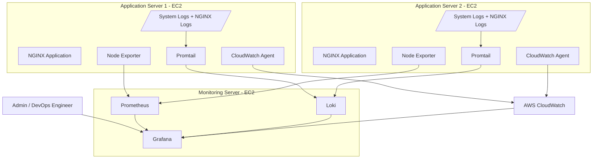

# Cloud-Native Monitoring and Observability Platform on AWS


---

## Project Overview

This project demonstrates the implementation of a centralized **Monitoring and Observability Platform on AWS** using open-source monitoring tools and AWS-native monitoring services.

The setup contains one dedicated **Monitoring Server** and two **Application Servers**. The Monitoring Server runs Prometheus, Grafana, and Loki, while the Application Servers run Node Exporter, Promtail, NGINX, and CloudWatch Agent.

The platform collects:

- Infrastructure metrics
- CPU, memory, disk, and network usage
- EC2 instance health
- NGINX access and error logs
- System logs
- Authentication logs
- CloudWatch custom metrics
- Centralized logs in Grafana

This project focuses on real-world observability concepts such as metrics collection, log aggregation, dashboard visualization, AWS-native monitoring, and troubleshooting visibility across multiple servers.

---

## Architecture Flow

```text
Users / Application Traffic
        |
        v
Application Servers / Worker Nodes / Kubernetes / Lambda
        |
        |---------------- Metrics ----------------|
        |                                         |
        v                                         v
Node Exporter / App Metrics                CloudWatch Metrics
        |                                         |
        v                                         v
Prometheus ---------------------------> Grafana Dashboards
        |
        v
Alertmanager
        |
        v
Email / Slack / Notification
```

```text
Application Logs / System Logs / Nginx Logs
        |
        v
     Promtail 
        |
        v
       Loki
        |
        v
Grafana Log Dashboards
```

```text
CloudWatch Alarm / Synthetics Canary
        |
        v
   EventBridge
        |
        v
Lambda Auto-Remediation
        |
        v
AWS Systems Manager
        |
        v
Restart unhealthy service on EC2
```

---

## Architecture Diagram using Mermaid



---

## Architecture Diagram

Add your architecture image here:

```text
Screenshots/1.Architecture-Diagram.png
```

```md

```

---

## Tools and Services Used

| Category | Tools / Services |
|---|---|
| Cloud Platform | AWS |
| Compute | Amazon EC2 |
| Metrics Collection | Prometheus, Node Exporter |
| Visualization | Grafana |
| Log Aggregation | Loki |
| Log Collection Agent | Promtail |
| AWS Native Monitoring | Amazon CloudWatch |
| AWS Agent | CloudWatch Agent |
| Web Server | NGINX |
| Operating System | Amazon Linux 2023 |
| Security | Security Groups, IAM Roles |
| Version Control | Git and GitHub |

---

## Server Setup

| Server | Purpose | Installed Components |
|---|---|---|
| Monitoring Server | Central monitoring and dashboard server | Prometheus, Grafana, Loki |
| App Server 1 | Application workload and monitored node | NGINX, Node Exporter, Promtail, CloudWatch Agent |
| App Server 2 | Application workload and monitored node | NGINX, Node Exporter, Promtail, CloudWatch Agent |

---

## Monitoring and Logging Flow

### Metrics Flow

```text
App Server 1 Node Exporter
        |
        v
Prometheus
        |
        v
Grafana Dashboard


App Server 2 Node Exporter
        |
        v
Prometheus
        |
        v
Grafana Dashboard
```

### Logs Flow

```text
/var/log/messages
/var/log/secure
/var/log/nginx/access.log
/var/log/nginx/error.log
        |
        v
Promtail
        |
        v
Loki
        |
        v
Grafana Explore / Log Dashboard
```

### CloudWatch Flow

```text
App Server
   |
   v
CloudWatch Agent
   |
   v
Amazon CloudWatch Metrics and Logs
```

---

## Repository Structure

```text
cloud-native-observability-platform/
│
├── prometheus/
│   ├── prometheus.yml
│   └── rules/
│       └── node-alerts.yml
│
├── grafana/
│   └── dashboards/
│       ├── node-exporter-dashboard.json
│       └── logs-dashboard.json
│
├── loki/
│   └── loki-config.yml
│
├── promtail/
│   ├── app-server-1-promtail.yml
│   └── app-server-2-promtail.yml
│
├── cloudwatch-agent/
│   └── cloudwatch-agent-config.json
│
├── scripts/
│   ├── install-prometheus.sh
│   ├── install-grafana.sh
│   ├── install-loki.sh
│   ├── install-node-exporter.sh
│   ├── install-promtail.sh
│   └── install-cloudwatch-agent.sh
│
├── Screenshots/
│   ├── 1.Architecture-Diagram.png
│   ├── 2.EC2-Instances.png
│   ├── 3.Prometheus-Targets.png
│   ├── 4.Grafana-Node-Exporter-Dashboard.png
│   ├── 5.Loki-Logs-Grafana.png
│   ├── 6.CloudWatch-Metrics.png
│   └── 7.CloudWatch-Logs.png
│
├── README.md
├── LICENSE
└── .gitignore
```

---

# Part 1: AWS Infrastructure Setup

## EC2 Instance Overview

Three EC2 instances are used in this project.

| Instance Name | Role | Recommended Type |
|---|---|---|
| `monitoring-server` | Prometheus, Grafana, Loki | `t3.small` |
| `app-server-1` | Application server and monitored node | `t2.micro` |
| `app-server-2` | Application server and monitored node | `t2.micro` |

For this project, Amazon Linux 2023 is used on all instances.

---

## Launch EC2 Instances

Open AWS Console and go to:

```text
AWS Console → EC2 → Instances → Launch Instance
```

Recommended configuration:

```text
AMI: Amazon Linux 2023
Instance Type:
  Monitoring Server: t3.small
  App Servers: t2.micro
Key Pair: Existing or new key pair
Storage:
  Monitoring Server: 20 GB
  App Servers: 8 GB
Region: ap-south-1
```

---

## Security Group Design

### Monitoring Server Security Group

| Port | Service | Source |
|---|---|---|
| 22 | SSH | Your IP |
| 3000 | Grafana | Your IP |
| 9090 | Prometheus | Your IP |
| 3100 | Loki | App Server Security Group |
| 9100 | Node Exporter | App Server Security Group / Monitoring SG |

### Application Server Security Group

| Port | Service | Source |
|---|---|---|
| 22 | SSH | Your IP |
| 80 | NGINX | Your IP / Internet |
| 9100 | Node Exporter | Monitoring Server Security Group |
| 9080 | Promtail | Monitoring Server Security Group |

> Note: In production, Prometheus, Loki, Grafana, Node Exporter, and Promtail ports should not be exposed publicly. Restrict access using private IPs, security groups, VPN, or bastion host.

---

# Part 2: Application Server Setup

This section should be completed on both Application Servers.

## Update System Packages

```bash
sudo dnf update -y
```

---

## Install NGINX

```bash
sudo dnf install nginx -y
sudo systemctl enable nginx
sudo systemctl start nginx
sudo systemctl status nginx
```

Create a simple application page:

```bash
echo "<h1>Application Server Observability Demo</h1>" | sudo tee /usr/share/nginx/html/index.html
```

Verify NGINX:

```bash
curl http://localhost
```

Generate sample access logs:

```bash
curl http://localhost
curl http://localhost/test
curl http://localhost/not-found
```

---

# Part 3: Install Node Exporter on App Servers

Node Exporter is installed on both app servers to expose Linux system metrics such as CPU, memory, disk, filesystem, and network metrics.

## Create Node Exporter User

```bash
sudo useradd --no-create-home --shell /sbin/nologin node_exporter
```

---

## Download and Install Node Exporter

```bash
cd /tmp

NODE_EXPORTER_VERSION="1.8.2"

wget https://github.com/prometheus/node_exporter/releases/download/v${NODE_EXPORTER_VERSION}/node_exporter-${NODE_EXPORTER_VERSION}.linux-amd64.tar.gz

tar -xvf node_exporter-${NODE_EXPORTER_VERSION}.linux-amd64.tar.gz

cd node_exporter-${NODE_EXPORTER_VERSION}.linux-amd64

sudo cp node_exporter /usr/local/bin/

sudo chown node_exporter:node_exporter /usr/local/bin/node_exporter
```

---

## Create Node Exporter Systemd Service

```bash
sudo vi /etc/systemd/system/node_exporter.service
```

Add the following configuration:

```ini
[Unit]
Description=Node Exporter
Wants=network-online.target
After=network-online.target

[Service]
User=node_exporter
Group=node_exporter
Type=simple
ExecStart=/usr/local/bin/node_exporter

Restart=always

[Install]
WantedBy=multi-user.target
```

Start Node Exporter:

```bash
sudo systemctl daemon-reload
sudo systemctl enable node_exporter
sudo systemctl start node_exporter
sudo systemctl status node_exporter
```

Verify metrics:

```bash
curl http://localhost:9100/metrics
```

---

# Part 4: Monitoring Server Setup

## Update Monitoring Server

SSH into the monitoring server:

```bash
ssh -i your-key.pem ec2-user@MONITORING_SERVER_PUBLIC_IP
```

Update packages:

```bash
sudo dnf update -y
sudo dnf install wget tar unzip git vim -y
```

---

# Part 5: Install Prometheus on Monitoring Server

Prometheus is used to scrape metrics from Node Exporter running on both application servers.

## Create Prometheus User and Directories

```bash
sudo useradd --no-create-home --shell /sbin/nologin prometheus

sudo mkdir -p /etc/prometheus
sudo mkdir -p /var/lib/prometheus
sudo mkdir -p /etc/prometheus/rules

sudo chown -R prometheus:prometheus /etc/prometheus /var/lib/prometheus
```

---

## Download and Install Prometheus

```bash
cd /tmp

PROMETHEUS_VERSION="3.13.0"

wget https://github.com/prometheus/prometheus/releases/download/v${PROMETHEUS_VERSION}/prometheus-${PROMETHEUS_VERSION}.linux-amd64.tar.gz

tar -xvf prometheus-${PROMETHEUS_VERSION}.linux-amd64.tar.gz

cd prometheus-${PROMETHEUS_VERSION}.linux-amd64

sudo cp prometheus /usr/local/bin/
sudo cp promtool /usr/local/bin/

sudo cp -r consoles /etc/prometheus
sudo cp -r console_libraries /etc/prometheus

sudo chown prometheus:prometheus /usr/local/bin/prometheus
sudo chown prometheus:prometheus /usr/local/bin/promtool
sudo chown -R prometheus:prometheus /etc/prometheus
```

---

## Configure Prometheus

Create Prometheus configuration file:

```bash
sudo vi /etc/prometheus/prometheus.yml
```

Add the following configuration:

```yaml
global:
  scrape_interval: 15s
  evaluation_interval: 15s

rule_files:
  - "/etc/prometheus/rules/*.yml"

scrape_configs:
  - job_name: "prometheus"
    static_configs:
      - targets:
          - "localhost:9090"

  - job_name: "app-servers-node-exporter"
    static_configs:
      - targets:
          - "APP_SERVER_1_PRIVATE_IP:9100"
          - "APP_SERVER_2_PRIVATE_IP:9100"
```

Replace:

```text
APP_SERVER_1_PRIVATE_IP
APP_SERVER_2_PRIVATE_IP
```

with the private IP addresses of your app servers.

---

## Create Prometheus Systemd Service

```bash
sudo vi /etc/systemd/system/prometheus.service
```

Add:

```ini
[Unit]
Description=Prometheus Monitoring System
Wants=network-online.target
After=network-online.target

[Service]
User=prometheus
Group=prometheus
Type=simple
ExecStart=/usr/local/bin/prometheus \
  --config.file=/etc/prometheus/prometheus.yml \
  --storage.tsdb.path=/var/lib/prometheus \
  --web.console.templates=/etc/prometheus/consoles \
  --web.console.libraries=/etc/prometheus/console_libraries \
  --web.listen-address=0.0.0.0:9090

Restart=always

[Install]
WantedBy=multi-user.target
```

Start Prometheus:

```bash
sudo systemctl daemon-reload
sudo systemctl enable prometheus
sudo systemctl start prometheus
sudo systemctl status prometheus
```

Open Prometheus in browser:

```text
http://MONITORING_SERVER_PUBLIC_IP:9090
```

Check targets:

```text
Prometheus → Status → Targets
```

Expected result:

```text
app-server-1:9100    UP
app-server-2:9100    UP
```

---

# Part 6: Install Grafana on Monitoring Server

Grafana is used to visualize metrics from Prometheus and logs from Loki.

## Add Grafana Repository

```bash
sudo vi /etc/yum.repos.d/grafana.repo
```

Add:

```ini
[grafana]
name=grafana
baseurl=https://rpm.grafana.com
repo_gpgcheck=1
enabled=1
gpgcheck=1
gpgkey=https://rpm.grafana.com/gpg.key
sslverify=1
sslcacert=/etc/pki/tls/certs/ca-bundle.crt
```

---

## Install Grafana

```bash
sudo dnf install grafana -y
```

Start Grafana:

```bash
sudo systemctl daemon-reload
sudo systemctl enable grafana-server
sudo systemctl start grafana-server
sudo systemctl status grafana-server
```

Open Grafana:

```text
http://MONITORING_SERVER_PUBLIC_IP:3000
```

Default credentials:

```text
Username: admin
Password: admin
```

Change the password after first login.

---

## Add Prometheus Data Source in Grafana

Go to:

```text
Grafana → Connections → Data Sources → Add Data Source → Prometheus
```

Prometheus URL:

```text
http://localhost:9090
```

Click:

```text
Save & Test
```

---

## Import Node Exporter Dashboard

Go to:

```text
Grafana → Dashboards → New → Import
```

Use dashboard ID:

```text
1860
```

Select Prometheus as the data source and import the dashboard.

This dashboard displays:

```text
CPU Usage
Memory Usage
Disk Usage
Network Traffic
Filesystem Usage
System Load
Uptime
```

---

# Part 7: Install Loki on Monitoring Server

Loki is used to store logs collected from the app servers.

## Create Loki User and Directories

```bash
sudo useradd --no-create-home --shell /sbin/nologin loki

sudo mkdir -p /etc/loki
sudo mkdir -p /var/lib/loki

sudo chown -R loki:loki /etc/loki /var/lib/loki
```

---

## Download and Install Loki

```bash
cd /tmp

LOKI_VERSION="2.9.8"

wget https://github.com/grafana/loki/releases/download/v${LOKI_VERSION}/loki-linux-amd64.zip

unzip loki-linux-amd64.zip

sudo mv loki-linux-amd64 /usr/local/bin/loki
sudo chmod +x /usr/local/bin/loki
sudo chown loki:loki /usr/local/bin/loki
```

---

## Configure Loki

```bash
sudo vi /etc/loki/loki-config.yml
```

Add:

```yaml
auth_enabled: false

server:
  http_listen_port: 3100
  grpc_listen_port: 9096

common:
  path_prefix: /var/lib/loki
  storage:
    filesystem:
      chunks_directory: /var/lib/loki/chunks
      rules_directory: /var/lib/loki/rules
  replication_factor: 1
  ring:
    instance_addr: 127.0.0.1
    kvstore:
      store: inmemory

schema_config:
  configs:
    - from: 2024-01-01
      store: tsdb
      object_store: filesystem
      schema: v13
      index:
        prefix: index_
        period: 24h

limits_config:
  retention_period: 168h
```

---

## Create Loki Systemd Service

```bash
sudo vi /etc/systemd/system/loki.service
```

Add:

```ini
[Unit]
Description=Loki Log Aggregation System
After=network.target

[Service]
User=loki
Group=loki
ExecStart=/usr/local/bin/loki -config.file=/etc/loki/loki-config.yml
Restart=always

[Install]
WantedBy=multi-user.target
```

Start Loki:

```bash
sudo systemctl daemon-reload
sudo systemctl enable loki
sudo systemctl start loki
sudo systemctl status loki
```

Test Loki:

```bash
curl http://localhost:3100/ready
```

Expected output:

```text
ready
```

---

# Part 8: Install Promtail on App Servers

Promtail is installed on both application servers to collect logs and send them to Loki.

## Create Promtail Directories

```bash
sudo mkdir -p /etc/promtail
sudo mkdir -p /var/lib/promtail
```

---

## Download and Install Promtail

```bash
cd /tmp

PROMTAIL_VERSION="2.9.8"

wget https://github.com/grafana/loki/releases/download/v${PROMTAIL_VERSION}/promtail-linux-amd64.zip

unzip promtail-linux-amd64.zip

sudo mv promtail-linux-amd64 /usr/local/bin/promtail
sudo chmod +x /usr/local/bin/promtail
```

---

## Configure Promtail on App Server 1

```bash
sudo vi /etc/promtail/promtail-config.yml
```

Add:

```yaml
server:
  http_listen_port: 9080
  grpc_listen_port: 0

positions:
  filename: /var/lib/promtail/positions.yaml

clients:
  - url: http://MONITORING_SERVER_PRIVATE_IP:3100/loki/api/v1/push

scrape_configs:
  - job_name: system-logs
    static_configs:
      - targets:
          - localhost
        labels:
          job: system
          host: app-server-1
          __path__: /var/log/messages

  - job_name: secure-logs
    static_configs:
      - targets:
          - localhost
        labels:
          job: secure
          host: app-server-1
          __path__: /var/log/secure

  - job_name: nginx-access-logs
    static_configs:
      - targets:
          - localhost
        labels:
          job: nginx-access
          host: app-server-1
          __path__: /var/log/nginx/access.log

  - job_name: nginx-error-logs
    static_configs:
      - targets:
          - localhost
        labels:
          job: nginx-error
          host: app-server-1
          __path__: /var/log/nginx/error.log
```

Replace:

```text
MONITORING_SERVER_PRIVATE_IP
```

with the private IP address of your monitoring server.

---

## Configure Promtail on App Server 2

Use the same configuration, but change the host label:

```yaml
host: app-server-2
```

This helps identify which server generated the log.

---

## Create Promtail Systemd Service

```bash
sudo vi /etc/systemd/system/promtail.service
```

Add:

```ini
[Unit]
Description=Promtail Log Collector
After=network.target

[Service]
User=root
ExecStart=/usr/local/bin/promtail -config.file=/etc/promtail/promtail-config.yml
Restart=always

[Install]
WantedBy=multi-user.target
```

Start Promtail:

```bash
sudo systemctl daemon-reload
sudo systemctl enable promtail
sudo systemctl start promtail
sudo systemctl status promtail
```

---

# Part 9: Add Loki Data Source in Grafana

Open Grafana:

```text
http://MONITORING_SERVER_PUBLIC_IP:3000
```

Go to:

```text
Grafana → Connections → Data Sources → Add Data Source → Loki
```

Loki URL:

```text
http://localhost:3100
```

Click:

```text
Save & Test
```

---

## Test Logs in Grafana Explore

Go to:

```text
Grafana → Explore
```

Run LogQL queries:

```logql
{job="system"}
```

```logql
{job="secure"}
```

```logql
{job="nginx-access"}
```

```logql
{job="nginx-error"}
```

Generate a test log from App Server 1:

```bash
logger "Test log from app-server-1"
```

Search in Grafana:

```logql
{host="app-server-1"}
```

Generate NGINX logs:

```bash
curl http://localhost
curl http://localhost/not-found
```

Search:

```logql
{job="nginx-access"}
```

---

# Part 10: Install CloudWatch Agent on App Servers

CloudWatch Agent is used to send system-level metrics and logs to Amazon CloudWatch.

## Attach IAM Role to App Servers

Create or attach an IAM role with the following managed policies:

```text
CloudWatchAgentServerPolicy
AmazonSSMManagedInstanceCore
```

Attach this IAM role to both app servers:

```text
EC2 → Instance → Actions → Security → Modify IAM Role
```

---

## Install CloudWatch Agent

Run this on both app servers:

```bash
sudo dnf install amazon-cloudwatch-agent -y
```

---

## Create CloudWatch Agent Configuration

```bash
sudo vi /opt/aws/amazon-cloudwatch-agent/bin/config.json
```

Add:

```json
{
  "agent": {
    "metrics_collection_interval": 60,
    "run_as_user": "root"
  },
  "metrics": {
    "namespace": "ObservabilityProject/EC2",
    "metrics_collected": {
      "mem": {
        "measurement": [
          "mem_used_percent"
        ]
      },
      "disk": {
        "measurement": [
          "used_percent"
        ],
        "resources": [
          "/"
        ]
      }
    }
  },
  "logs": {
    "logs_collected": {
      "files": {
        "collect_list": [
          {
            "file_path": "/var/log/messages",
            "log_group_name": "/observability/ec2/messages",
            "log_stream_name": "{instance_id}"
          },
          {
            "file_path": "/var/log/secure",
            "log_group_name": "/observability/ec2/secure",
            "log_stream_name": "{instance_id}"
          },
          {
            "file_path": "/var/log/nginx/access.log",
            "log_group_name": "/observability/nginx/access",
            "log_stream_name": "{instance_id}"
          },
          {
            "file_path": "/var/log/nginx/error.log",
            "log_group_name": "/observability/nginx/error",
            "log_stream_name": "{instance_id}"
          }
        ]
      }
    }
  }
}
```

---

## Start CloudWatch Agent

```bash
sudo /opt/aws/amazon-cloudwatch-agent/bin/amazon-cloudwatch-agent-ctl \
-a fetch-config \
-m ec2 \
-s \
-c file:/opt/aws/amazon-cloudwatch-agent/bin/config.json
```

Check CloudWatch Agent status:

```bash
sudo /opt/aws/amazon-cloudwatch-agent/bin/amazon-cloudwatch-agent-ctl -a status
```

Verify in AWS Console:

```text
CloudWatch → Metrics → All metrics → ObservabilityProject/EC2
CloudWatch → Logs → Log groups
```

---

# Part 11: Add CloudWatch Data Source in Grafana

To visualize AWS CloudWatch metrics in Grafana, attach a role to the Monitoring Server with CloudWatch read permissions.

Recommended policy:

```text
CloudWatchReadOnlyAccess
```

Then in Grafana:

```text
Grafana → Connections → Data Sources → Add Data Source → CloudWatch
```

Configuration:

```text
Authentication Provider: AWS SDK Default
Default Region: ap-south-1
```

Click:

```text
Save & Test
```

Now Grafana can visualize:

```text
EC2 CPUUtilization
CloudWatch Agent memory metrics
CloudWatch Agent disk metrics
CloudWatch Logs
```

---

# Part 12: Prometheus Alert Rules

Create alert rule file:

```bash
sudo vi /etc/prometheus/rules/node-alerts.yml
```

Add:

```yaml
groups:
  - name: node-alerts
    rules:
      - alert: InstanceDown
        expr: up == 0
        for: 1m
        labels:
          severity: critical
        annotations:
          summary: "Instance is down"
          description: "Target {{ $labels.instance }} has been down for more than 1 minute."

      - alert: HighCPUUsage
        expr: 100 - (avg by(instance) (rate(node_cpu_seconds_total{mode="idle"}[5m])) * 100) > 80
        for: 2m
        labels:
          severity: warning
        annotations:
          summary: "High CPU usage detected"
          description: "CPU usage is above 80% on {{ $labels.instance }}."

      - alert: LowDiskSpace
        expr: (node_filesystem_avail_bytes{mountpoint="/",fstype!="tmpfs"} / node_filesystem_size_bytes{mountpoint="/",fstype!="tmpfs"}) * 100 < 20
        for: 2m
        labels:
          severity: warning
        annotations:
          summary: "Low disk space detected"
          description: "Disk space is below 20% on {{ $labels.instance }}."

      - alert: HighMemoryUsage
        expr: (1 - (node_memory_MemAvailable_bytes / node_memory_MemTotal_bytes)) * 100 > 80
        for: 2m
        labels:
          severity: warning
        annotations:
          summary: "High memory usage detected"
          description: "Memory usage is above 80% on {{ $labels.instance }}."
```

Check Prometheus configuration:

```bash
promtool check config /etc/prometheus/prometheus.yml
```

Restart Prometheus:

```bash
sudo systemctl restart prometheus
```

Check alerts:

```text
http://MONITORING_SERVER_PUBLIC_IP:9090/alerts
```

---

# Part 13: Grafana Dashboard Setup

## Dashboard 1: Node Exporter Full Dashboard

Use Grafana dashboard ID:

```text
1860
```

This dashboard shows:

```text
CPU Usage
Memory Usage
Disk Usage
Network Traffic
System Load
Filesystem Usage
Uptime
```

---

## Dashboard 2: Logs Dashboard

Create panels using Loki queries:

```logql
{job="system"}
```

```logql
{job="secure"}
```

```logql
{job="nginx-access"}
```

```logql
{job="nginx-error"}
```

---

## Dashboard 3: CloudWatch Agent Dashboard

Create panels for:

```text
Memory Used Percent
Disk Used Percent
CloudWatch Log Groups
EC2 CPU Utilization
```

---

# Part 14: Validation and Testing

## Check Running Services

On Monitoring Server:

```bash
sudo systemctl status prometheus
sudo systemctl status grafana-server
sudo systemctl status loki
```

On App Servers:

```bash
sudo systemctl status nginx
sudo systemctl status node_exporter
sudo systemctl status promtail
sudo /opt/aws/amazon-cloudwatch-agent/bin/amazon-cloudwatch-agent-ctl -a status
```

---

## Verify Prometheus Targets

Open:

```text
http://MONITORING_SERVER_PUBLIC_IP:9090/targets
```

Expected result:

```text
prometheus                  UP
app-server-1:9100           UP
app-server-2:9100           UP
```

---

## Verify Logs in Loki

Run on App Server 1:

```bash
logger "Application test log from app-server-1"
```

Run on App Server 2:

```bash
logger "Application test log from app-server-2"
```

Check in Grafana Explore:

```logql
{host="app-server-1"}
```

```logql
{host="app-server-2"}
```

---

## Verify NGINX Logs

Generate traffic:

```bash
curl http://localhost
curl http://localhost/not-found
```

Check logs:

```bash
sudo tail -f /var/log/nginx/access.log
sudo tail -f /var/log/nginx/error.log
```

Check in Grafana:

```logql
{job="nginx-access"}
```

```logql
{job="nginx-error"}
```

---

## Verify CloudWatch Logs

Open AWS Console:

```text
CloudWatch → Logs → Log groups
```

Check the following log groups:

```text
/observability/ec2/messages
/observability/ec2/secure
/observability/nginx/access
/observability/nginx/error
```

---

# Screenshots to Add

Add the following screenshots in the `Screenshots/` folder:

| Screenshot | Description |
|---|---|
| `1.Architecture-Diagram.png` | Complete observability architecture |
| `2.EC2-Instances.png` | Monitoring and app servers |
| `3.Security-Groups.png` | Security group rules |
| `4.Prometheus-Targets.png` | Targets showing UP |
| `5.Grafana-Node-Exporter-Dashboard.png` | Infrastructure dashboard |
| `6.Loki-Logs-Grafana.png` | Logs visible in Grafana |
| `7.CloudWatch-Agent-Metrics.png` | CloudWatch custom metrics |
| `8.CloudWatch-Log-Groups.png` | CloudWatch log groups |
| `9.Nginx-Logs.png` | Application access/error logs |
| `10.Alert-Rules.png` | Prometheus alert rules |

---

# Troubleshooting

## Prometheus Target Down

Check Node Exporter:

```bash
sudo systemctl status node_exporter
```

Check security group:

```text
Monitoring Server must be allowed to access App Servers on port 9100
```

Test from Monitoring Server:

```bash
curl http://APP_SERVER_PRIVATE_IP:9100/metrics
```

---

## Grafana Not Opening

Check Grafana service:

```bash
sudo systemctl status grafana-server
```

Check security group:

```text
Port 3000 must be open from your IP
```

---

## Loki Not Ready

Check Loki service:

```bash
sudo systemctl status loki
```

Check readiness:

```bash
curl http://localhost:3100/ready
```

---

## Promtail Not Sending Logs

Check Promtail service:

```bash
sudo systemctl status promtail
```

Check Promtail logs:

```bash
sudo journalctl -u promtail -f
```

Check Loki connectivity from App Server:

```bash
curl http://MONITORING_SERVER_PRIVATE_IP:3100/ready
```

---

## CloudWatch Agent Not Sending Logs

Check IAM role:

```text
CloudWatchAgentServerPolicy must be attached
```

Check agent status:

```bash
sudo /opt/aws/amazon-cloudwatch-agent/bin/amazon-cloudwatch-agent-ctl -a status
```

Restart agent:

```bash
sudo /opt/aws/amazon-cloudwatch-agent/bin/amazon-cloudwatch-agent-ctl \
-a fetch-config \
-m ec2 \
-s \
-c file:/opt/aws/amazon-cloudwatch-agent/bin/config.json
```

---

# Key Learnings

Through this project, I learned how to:

```text
Set up centralized monitoring using Prometheus
Collect Linux system metrics using Node Exporter
Create Grafana dashboards for real-time visibility
Collect and centralize logs using Promtail and Loki
Monitor EC2 memory, disk, and logs using CloudWatch Agent
Use CloudWatch for AWS-native metrics and log monitoring
Troubleshoot infrastructure and application issues using metrics and logs
Design a production-style monitoring architecture on AWS
```

---

# Project Outcome

This project successfully demonstrates a centralized observability platform where two application servers are monitored from a dedicated monitoring server.

Final implementation includes:

```text
Prometheus metrics collection
Node Exporter system metrics
Grafana dashboards
Loki log aggregation
Promtail log collection
CloudWatch Agent metrics and logs
NGINX application log monitoring
System and authentication log collection
```

---

# Resume Highlight

```text
Built a centralized AWS observability platform using Prometheus, Grafana, Loki, Promtail, Node Exporter, and CloudWatch Agent to monitor two EC2 application servers with real-time metrics, centralized logs, and dashboard-based troubleshooting.
```

---

# Future Improvements

Possible future enhancements:

```text
Add Alertmanager for Prometheus alerts
Configure SNS email alerts
Add CloudWatch alarms
Add Lambda-based auto-remediation
Add Kubernetes monitoring using kube-prometheus-stack
Add AWS X-Ray for distributed tracing
Add Terraform automation for infrastructure provisioning
```

---

# Conclusion

This project demonstrates a practical monitoring and observability setup used in real-world DevOps and Cloud environments. It combines open-source monitoring tools with AWS-native monitoring services to provide complete visibility into application servers, infrastructure metrics, and logs.

The project is useful for understanding how DevOps engineers monitor production systems, debug issues, analyze logs, and maintain infrastructure reliability.
